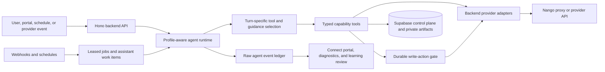

# Building a Maintainer-Operated AI Assistant: Inside DelegateKit

The question behind DelegateKit is simple: what does an AI assistant look like when it has to do real operational work, not just generate plausible text?

The moment an assistant can read email, update a CRM, move files, send documents for signature, or call someone, the hard part stops being the chat interface. The hard part becomes identity, evidence, permissions, retries, provider state, human review, and being able to prove what actually happened.

[DelegateKit](https://github.com/thierryskoda/DelegateKit) is the open-source TypeScript project I built to explore that problem. It is infrastructure for private, maintainer-operated assistants: a builder configures a profile, connects its accounts, chooses its capabilities and write policies, and operates the system alongside the person using the assistant.

This is not a general-purpose autonomous agent framework or a no-code workflow builder. It is an opinionated attempt to make agentic software behave like an accountable application.

## The core idea: bounded agency

Most agent demos put a model in a loop, attach a large collection of tools, and let it decide what to do. DelegateKit also has an agent loop, but the useful system is everything around it.

The model is allowed to reason flexibly inside boundaries that deterministic code owns:

- The profile defines identity, connected accounts, enabled capabilities, client-specific guidance, and write policy.
- Typed tool contracts define exactly what the model can request and what evidence it receives back.
- The backend owns credentials, provider calls, resource isolation, validation, and side-effect execution.
- External writes become durable actions with idempotency, lifecycle state, and optional human approval.
- Files become profile-scoped artifacts with hashes, rather than anonymous blobs passed between prompts.
- Webhooks, schedules, work items, and leased jobs make asynchronous work observable and retryable.
- Raw events preserve enough evidence to debug behavior and propose targeted improvements.

The architecture looks roughly like this:



There are three user-facing surfaces today:

1. A chat channel, primarily Telegram, where the assistant receives messages and attachments and returns text or files.
2. A mobile-first Connect portal for OAuth, approvals, proposals, learning recommendations, and secure browser handoffs.
3. An experimental, non-production MCP bridge that exposes a read-only subset of profile tools to a ChatGPT app.

Underneath those surfaces is one profile-scoped backend.

## A profile is the real product boundary

The first design choice was to make a client profile more than a prompt.

A profile has an identity and timezone, one assistant, one or more channels, connected provider accounts, capability bindings, guidance, scheduled tasks, event routes, files, artifacts, actions, and a write policy. Every important row and operation is scoped back to that profile.

The public repository includes a sanitized [client template](https://github.com/thierryskoda/DelegateKit/tree/main/clients/_template). Its initial configuration is intentionally explicit:

```ts
export default defineClientSeed({
  profile: {
    id: "acme",
    displayName: "Acme Client",
    timezone: "America/Toronto",
    status: "active",
  },
  initialCapabilities: [
    "google-drive",
    "gmail",
    "monday",
    "boldsign",
    "document-tools",
    "file-analysis",
  ],
  initialWritePolicy: {
    defaultMode: "auto_execute",
    actions: {
      "gmail.message.send": "needs_review",
      "boldsign.signature_request.send": "needs_review",
      "monday.item.update": "needs_review",
    },
  },
});
```

That source file is only bootstrap data. Once a profile has launched, its operational state lives in the database. In particular, client-specific guidance is database-owned so it can evolve without a source deployment. Provider and capability guidance stays source-authored because it is reusable product behavior.

This separation also makes the open-source boundary clearer. The repository contains schemas, templates, contracts, and sanitized fixtures. Real client data, credentials, provider connection IDs, runtime logs, downloaded files, and live guidance belong outside the source tree.

## What happens during one assistant turn

The main runtime is built with Mastra and a DeepSeek-backed model. A normal channel turn does considerably more than call `agent.generate()`.

1. The backend authenticates the channel, resolves the sender to a profile, and creates a session key isolated to that assistant, channel, and sender.
2. It loads a bounded slice of recent conversation history and selects the context relevant to the current message.
3. Inbound attachments are decoded, size-checked, hashed, and saved as private profile artifacts before the model sees references to them.
4. The runtime loads the indexes for source guidance and live profile guidance.
5. Two lightweight structured decisions run in parallel: one selects the smallest useful tool surface for this turn; the other selects relevant guidance.
6. The main agent receives the base safety instructions, selected guidance, current evidence, and only the chosen tools.
7. Tool calls go back through the backend executor, where identity, input schemas, readiness, profile ownership, and—where the call represents an external side effect—write policy are enforced.
8. The final response, tool activity, model usage, guidance selection, tool selection, channel delivery, and failures are recorded as agent-run evidence.

The generated [tool inventory](https://github.com/thierryskoda/DelegateKit/blob/main/tool-inventory.generated.md) currently contains 183 canonical contracts: 180 capability tools and three built-ins. Giving all of them to the main model on every message would create a large, ambiguous prompt. The turn-level selector can grant a whole surface—such as Gmail or Google Drive—or one or two exact tools. If the selector fails, it falls back to the full candidate set rather than silently removing a needed capability.

This pattern has been useful beyond token savings. Tool choice is itself an observable decision. I can inspect what was available, what was selected, and whether a bad outcome came from routing, guidance, tool semantics, provider behavior, or the main model.

## Tool contracts are interfaces for a probabilistic caller

In normal application code, a function signature is written for another engineer and a compiler. Agent tools are different: their primary caller is a model that can misunderstand names, omit fields, invent fields, or overstate a result.

DelegateKit treats every tool contract as an LLM-facing API. A contract owns:

- a stable name and capability surface;
- whether it is a read or write;
- a standardized description covering when to use it, what it does, what it returns, and when not to use it;
- a Zod input schema and generated JSON Schema;
- a Zod output schema;
- an execution kind;
- and, for external writes, the action type that must pass through policy.

All backend tools return one canonical envelope:

```json
{ "data": { "...": "validated success payload" } }
```

or:

```json
{ "error": { "message": "client-safe failure explanation" } }
```

External writes return an even smaller assistant-facing receipt: a deterministic result sentence, an action ID, lifecycle status, and structured recovery detail only when the write failed or is uncertain.

That result sentence is deliberately generated by backend code, not improvised by the model. The model should not have to infer whether an email was sent from a raw Gmail response or decide whether a provider's `202` means “done.” The backend translates the provider outcome into the shortest truthful statement the assistant can use.

The contract packages are separate from backend implementations. Gmail, Google Calendar, Drive, OneDrive, Monday, and the other capabilities each own their public tool schemas, while capability modules in the backend own execution. This makes it possible to typecheck the boundary without putting provider logic in the agent runtime.

## Integrations are provider-first and backend-owned

I initially found generic concepts such as “email,” “calendar,” and “files” attractive. In practice, they hid the differences that mattered.

Gmail and Outlook have different thread, send, auth, and webhook semantics. Google Calendar and Outlook Calendar expose different provider behavior. OneDrive and SharePoint need separate discovery and event routing. Monday is not a generic CRM once an assistant needs to understand boards, groups, columns, subitems, and updates.

DelegateKit therefore uses provider-first capability surfaces. The user can still say “check my email,” but the contracts and backend remain explicit: `gmail_message_get`, `outlook_mail_message_get`, `google_drive_search`, `microsoft_onedrive_files_search`, and so on.

Nango owns OAuth and token-injecting proxy transport. The TypeScript backend owns the provider HTTP calls, request mapping, normalization, validation, diagnostics, and action execution. This avoids splitting business behavior between the source repository and remotely deployed integration functions.

Google uses one shared OAuth account for Gmail, Calendar, and Drive, while those capabilities remain separate internally. Outlook Mail, Calendar, and Microsoft To Do follow a similar account grouping. Shared authentication does not require pretending that all provider behavior is the same.

Some integrations use backend-managed credentials instead of OAuth. Those still need profile isolation. BoldSign is a good example: multiple profiles can share a managed API account, but a database ownership ledger assigns each document to exactly one profile. Unknown historical documents stay invisible until a maintainer explicitly assigns them. The shared credential is transport, not a privacy boundary.

## A write is a durable action, not just a tool call

Reads and internal transformations can often run immediately. An external write—sending an email, changing a CRM item, moving a file, creating a calendar event, starting a call—takes a different path.

The tool first builds a validated write plan. That plan contains the provider payload, a stable request hash, an equivalent-action key for deduplication, and human-readable review details. The profile write policy then resolves the action into one of three modes:

- `auto_execute`: create the action record and execute it immediately;
- `needs_review`: persist it as pending approval and show it in Connect;
- `blocked`: record the attempt but do not perform the side effect.

The action has a lifecycle independent of the model turn: `pending_approval`, `processing`, `executed`, `rejected`, `expired`, `failed`, `unknown`, or `blocked`. Repeated equivalent tool calls join the existing action instead of blindly repeating the side effect.

This means a chat response can say “this is waiting for your approval” because that is a database fact, not a conversational convention. Approving from the portal executes the exact stored payload that was reviewed. The assistant cannot quietly change the recipient or update fields between preview and execution.

The [Connect app](https://github.com/thierryskoda/DelegateKit/tree/main/apps/connect) combines three kinds of human decisions in one place:

- external actions that need approval;
- higher-level proposals, currently including follow-up email proposals;
- learning recommendations that would change future assistant behavior.

The same portal also handles account connections and reconnections. It is intentionally small: it is the human control plane around the assistant, not a second full application.

## Artifacts are the bridge between capabilities

Multi-provider work often involves files. A PDF can arrive in Telegram, be found in Drive, get analyzed, be rendered from a DOCX template, be sent through BoldSign, then be filed back into a provider folder.

Passing raw bytes through model context or inventing provider-specific file handoffs would make this fragile. DelegateKit instead stores files as private, profile-scoped artifacts in Supabase Storage. Artifact metadata includes the filename, MIME type, byte size, SHA-256 digest, origin, and optional idempotency key.

Every consuming capability validates profile ownership and, where relevant, the expected hash and MIME type. The hash matters when the user approved one exact preview and a later provider write must use that exact file.

The document tools are intentionally provider-independent. They can:

- create a PDF from structured content;
- fetch and convert document sources;
- render DOCX templates with explicit field values;
- emit both rendered DOCX and PDF artifacts;
- and create preview artifacts.

File-analysis tools can extract deterministic text from PDFs and text-like files, use vision for images and scanned PDFs, or return structured data. Provider tools can save attachments into the artifact store or upload an existing artifact. BoldSign and email tools consume artifacts without needing to understand the internal document-rendering workflow.

That produces a clean composition rule: document tools produce artifacts, provider tools operate on artifacts, and profile guidance decides the business sequence.

## The assistant can react without becoming an invisible daemon

A useful operational assistant cannot depend on the user opening a chat every time. DelegateKit supports two asynchronous sources of work.

First, scheduled tasks can run once, at an interval, or from a timezone-aware cron expression. A schedule stores human-readable instructions and materializes an `agent.run.execute` job for the appropriate profile.

Second, provider webhook adapters normalize events such as incoming mail, calendar changes, Drive changes, Monday item changes, and BoldSign status updates. Profile work routes decide which exact event types matter. A small relevance classifier filters obvious noise according to route instructions, while failing open if classification itself fails.

Provider deliveries, assistant work items, and backend jobs use dedupe keys at the boundaries where retries or duplicate callbacks can occur. Jobs carry priority, `run_after`, attempt limits, leases, and retry state. A provider callback arriving twice should join existing work instead of producing two client-visible follow-ups.

Both schedules and routed provider events ultimately run the same profile-aware assistant. The difference is explicit task context: a scheduled instruction or provider event is evidence for the run, not a hidden prompt pretending to be a user message.

## Context is routed, not dumped into every prompt

“Give the model more context” works until a system has several providers, long chat history, client-specific procedures, and years of activity.

DelegateKit uses multiple explicit context owners:

- Recent channel messages provide bounded conversational continuity.
- Provider tools remain the source of truth for live email, calendar, CRM, and file state.
- Profile activity search exposes prior durable conclusions when the user asks what already happened.
- Source-authored guidance explains reusable provider and module behavior.
- Database-owned profile guidance explains the client's workflow rules and preferences.
- Scheduled tasks and work routes own recurring or event-driven instructions.

The runtime first loads compact guidance indexes, then selects and injects only the markdown relevant to the turn. The assistant does not receive a generic “memory” bucket. DelegateKit had one and removed it because preferences, workflows, current facts, schedules, and source-of-truth data kept overlapping.

The rule now is that durable state needs an explicit owner. Reusable behavior belongs in profile guidance. Current business facts belong in providers. Recurring work belongs in schedules. Event-driven work belongs in routes. If an observation has no consumer, it should not be persisted just because it might be useful someday.

## Learning is evidence-backed and reviewable

Each agent run writes typed raw events for messages, model responses, tool calls, tool results, actions, artifacts, work items, and selection decisions. Product views are derived from that ledger instead of maintaining a separate “history” table for every screen.

A daily learning-review process examines a bounded activity window for each profile. Specialized reviewers can propose changes to:

- profile guidance;
- scheduled tasks;
- provider-event work routes;
- or no state at all when the evidence does not justify a change.

Candidates include evidence references, confidence, counter-evidence, a typed patch, and revision expectations. Only a narrow class of changes can auto-apply: high-confidence instruction updates to an existing schedule or work route, backed entirely by explicit client messages. Creating, deleting, pausing, or structurally changing durable behavior requires approval in Connect. Guidance changes also require portal approval.

This is less magical than “the assistant learns you automatically,” which is exactly the point. It creates a traceable path from observed friction to a small proposed state change.

There is a second improvement loop for maintainers. Diagnostic scripts can collect redacted runtime evidence outside the repository and ask a headless coding agent for ranked code improvements. Client behavior improvements and codebase improvements are separate workflows with separate evidence and authority.

## What can you build with it?

The current capability surface covers a fairly broad set of operational work:

| Area           | Capabilities                                                                                                                              |
| -------------- | ----------------------------------------------------------------------------------------------------------------------------------------- |
| Email          | Gmail and Outlook search, read, attachments, reply, forward, send, move, mark read, and delete                                            |
| Calendar       | Google and Outlook calendar discovery, event search, availability, free slots, create, update, and cancel                                 |
| Files          | Google Drive, OneDrive, and SharePoint discovery, download/save, organization, upload, sharing, permissions, and deletion where supported |
| Work systems   | Monday boards, groups, columns, items, subitems, updates, and files; Microsoft To Do lists and tasks                                      |
| Documents      | PDF creation, DOCX template rendering, conversion, preview, text extraction, image/PDF vision, and structured extraction                  |
| Signatures     | BoldSign send, list/status, download, remind, and cancel with profile-owned documents                                                     |
| Web            | Public search and fetch, browser extraction and actions, saved auth contexts, and live human handoff for login, MFA, or CAPTCHA           |
| Communications | Telegram delivery, Twilio SMS, and bounded outbound phone calls                                                                           |
| Runtime        | Approvals, proposals, scheduled tasks, event routes, work items, profile activity, profile files, links, and time resolution              |

The interesting examples are the ones that compose several of these surfaces.

### A multi-source deal brief

The user asks, “What is going on with this deal?” The assistant can search Monday for the active record, read the latest client email, inspect the Drive folder for relevant PDFs, check BoldSign status, and return a concise list of the current stage, blockers, pending signature, and next action.

Each source remains independent. If Gmail is disconnected, the answer should still report the verified CRM and signature state, then name email as the unchecked source. Partial evidence should produce a partial but truthful answer, not an invented complete one.

### Generate, verify, approve, and sign a document

The assistant finds a DOCX template in Drive, saves it as an artifact, renders explicit field values, creates a PDF preview, and extracts the rendered text to verify that placeholders were replaced. The user approves the exact preview. Only then does the BoldSign action send the same hash-verified PDF for signature.

This workflow crosses Drive, document rendering, file analysis, artifacts, approvals, and BoldSign without teaching any one provider about the whole business process.

### File intake and reconciliation

A user can send a receipt image, PDF, or CSV. The assistant can inspect it, extract facts, search Gmail for matching evidence, report matched, ambiguous, and missing items, then wait for an explicit filing or CRM instruction. If multiple folders or records match, it asks a focused question instead of guessing where to write.

### Calendar and communication work

The assistant can summarize today's meetings, find free slots for a client call, and wait for a selected time and clear attendee details before creating the event. It can draft or send an email, send an SMS, or start a phone call from a bounded call brief. Each side effect follows that profile's write policy.

### Proactive attention lists

A scheduled task can ask for a morning attention list, or a provider event can create work when a relevant email or signature update arrives. The assistant can combine active CRM blockers, unread client messages, expiring approvals, and pending signatures while filtering unrelated provider noise.

### Browser work with a human at the authentication boundary

Public pages can be searched or extracted directly. Authenticated browser work can use a saved browser context. When a site requires login, MFA, CAPTCHA, or explicit user control, the assistant creates a secure handoff. The user opens the live browser from Connect, completes the sensitive step outside chat, and returns control when done.

## How the repository is organized

The monorepo follows ownership rather than technical layer alone:

- `apps/backend/src/capabilities/*` owns capability-specific handlers, provider adapters, webhooks, and lifecycle hooks.
- `apps/backend/src/product/*` owns durable product state such as actions, artifacts, accounts, schedules, work items, proposals, and learning reviews.
- `apps/backend/src/integrations/*` owns neutral provider plumbing such as Nango transport and webhook substrate.
- `apps/backend/src/runtime/*` owns the agent runner, tool execution, job worker, and selection machinery.
- `packages/*-contracts` owns public schemas for each capability.
- `capabilities/*/GUIDANCE.ts` and `runtime-guidance/*/GUIDANCE.ts` own reusable, typed runtime instructions.
- `apps/connect` is the React control plane.
- `supabase/migrations` is the forward-only history of the control-plane database.

The stack is TypeScript, npm workspaces and Turborepo, Hono, Mastra, the Vercel AI SDK, DeepSeek models, Supabase Postgres/Auth/Storage, React, Vite, TanStack Router and Query, Nango, Browserbase/Stagehand, Twilio, and direct provider APIs.

## Testing an agent system without testing only the model

DelegateKit intentionally separates deterministic capability coverage from natural-language scenario coverage.

Capability E2Es call every canonical tool contract through the real backend boundary. A coverage ledger fails if a contract is neither exercised nor explicitly waived. These tests verify schemas, provider adapters, action policy, storage, webhook processing, and tool result shapes without depending on a model choosing the tool correctly.

At the higher level, a separate [scenario catalog](https://github.com/thierryskoda/DelegateKit/blob/main/tests/e2e/scenarios/scenarios.ts) defines realistic client requests and judge criteria. It currently documents 36 green product paths, including ambiguous recipients, missing document fields, partial provider failures, duplicate webhooks, session isolation, prompt-injection attempts, PDF analysis, calendar work, calls, and CSV reconciliation. The catalog is deliberately not an executable coverage claim by itself: exact prompts, fixtures, tool assertions, provider evidence, and LLM judges belong in scenario E2Es.

Provider sandboxes make these E2Es reproducible without turning each test into a mock of the entire backend. Dynamic E2E runtime lanes lease isolated Supabase instances so tests can run in parallel without sharing profile state. Live provider tests remain possible where they add value.

The repository does not use package-local unit test frameworks. TypeScript, Zod, deterministic source guards, generated inventories, semantic checks, and real E2Es divide that work instead. That is an opinionated tradeoff: more emphasis on system boundaries and less on testing small implementation details in isolation.

The fast source check runs guards, dead-code analysis, typechecking, and the deterministic E2E-harness checks:

```bash
npm install
npm run check
```

For broader validation:

```bash
npm run typecheck
npm run build
npm run e2e -- capabilities
npm run e2e -- scenarios
```

## What I learned building it

Several lessons kept reappearing.

**The best place to constrain an agent is usually outside the prompt.** Prompt rules matter, but profile ownership checks, Zod schemas, write policies, hashes, idempotency keys, and backend receipts are stronger boundaries.

**Agent tool design is API design for an unreliable but capable caller.** Names, descriptions, required fields, output size, and failure wording materially change behavior. Returning raw provider payloads is rarely the best interface for the model.

**External writes need durable identity.** A side effect should survive beyond the tool call that requested it. It needs a stable action record, a dedupe key, lifecycle state, reviewed payload, and provider evidence.

**Generic provider abstractions often move complexity rather than remove it.** Provider-first surfaces can look repetitive, but the resulting contracts are more honest, easier to test, and easier to delete.

**Files need a first-class internal representation.** Hash-addressed, profile-scoped artifacts make multi-provider document workflows much easier to reason about than byte blobs or provider-specific special cases.

**“Memory” is not a sufficient data model.** Durable information should be stored where its lifecycle and consumer are clear. Otherwise a memory layer gradually becomes stale desired state, hidden workflow configuration, and duplicated provider facts.

**Proactive behavior needs the same rigor as user-triggered behavior.** Webhooks and schedules are not special permission to bypass tool contracts, write policy, or evidence. They should enter through durable, deduplicated work with explicit task context.

**Maintainer-operated is a useful product constraint.** It accepts that capable assistants still need someone to configure integrations, inspect diagnostics, approve sensitive changes, and improve the system. That constraint led to a simpler and more accountable architecture than pretending the assistant can safely operate everything by itself.

## What DelegateKit is not yet

The project is open source, but it is not a hosted product. The repository intentionally does not include a production deployment target, real client profiles, provider credentials, or private operator runbooks. You bring your own infrastructure and decide how much of the capability surface to enable.

Some surfaces are deliberately experimental. The ChatGPT Apps SDK/MCP bridge is disabled in production and currently exposes a curated read-only subset. The Connect portal is a focused control plane, not a general admin suite. Telegram is the primary real chat ingress in the public code; other channel ideas should not be confused with shipped adapters.

There are also unavoidable costs to this architecture: many explicit contracts, provider-specific packages, forward migrations, review DTOs, E2E infrastructure, and more backend code than an agent demo needs. I think those costs are worth paying once the assistant can affect real systems, but they are still costs.

## Closing

DelegateKit started from an agent, but the project became a study of the systems required to trust one.

The model is only one component. The rest of the work is building clear boundaries around identity, context, tools, provider access, files, side effects, asynchronous execution, human decisions, and evidence. When those pieces are explicit, the assistant can do surprisingly broad work without asking the model to be the database, policy engine, integration layer, and auditor at the same time.

The source is available at [github.com/thierryskoda/DelegateKit](https://github.com/thierryskoda/DelegateKit). The most useful entry points for builders are the [architecture rationale records](https://github.com/thierryskoda/DelegateKit/tree/main/architecture-rationale), the generated [tool inventory](https://github.com/thierryskoda/DelegateKit/blob/main/tool-inventory.generated.md), the [client template](https://github.com/thierryskoda/DelegateKit/tree/main/clients/_template), and the [E2E scenario catalog](https://github.com/thierryskoda/DelegateKit/blob/main/tests/e2e/scenarios/scenarios.ts).
