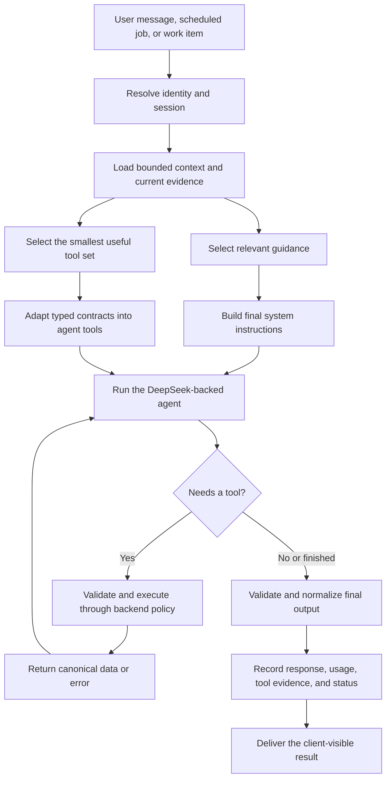

# DeepSeek LLM Client and Agent Flow Blueprint

This document explains, at an architectural level, how DelegateKit uses DeepSeek models. It is intended to be copied into another TypeScript project as context for coding agents.

**Status:** implementation reference, verified against the repository on 2026-07-29. The source files in the final source map remain authoritative; update or supersede this guide when the client or turn runner changes materially.

The central idea is simple:

> Keep the provider client small. Put product behavior, tool policy, context selection, safety, and persistence around it in separate layers.

This is a snapshot of the approach, not a library that must be copied line for line. Model names, limits, fallbacks, and storage should be adapted to the new product.

## What we built

DelegateKit has two related LLM paths:

1. **Focused LLM helpers**
   - Generate normal text.
   - Generate JSON validated by Zod.
   - Apply timeouts, retries, limited output repair, and safe diagnostics.
   - Default to a DeepSeek model but accept any Vercel AI SDK `LanguageModel`.

2. **A tool-using assistant runtime**
   - Prepare the current turn.
   - Select relevant history, instructions, and tools.
   - Run a DeepSeek-backed Mastra agent.
   - Execute tool calls through typed backend boundaries.
   - Record the run, tool evidence, usage, response, and failures.

The provider wrapper does not know about users, databases, channels, approvals, or business workflows. The runtime owns those concerns.

## Stack

- TypeScript
- Vercel AI SDK (`ai`)
- DeepSeek AI SDK provider (`@ai-sdk/deepseek`)
- Zod for structured output and boundary validation
- Mastra for the multi-step tool-using agent loop
- A database-backed run and event ledger

Mastra is useful for the main agent loop, but it is not required for the smaller text and structured-decision helpers.

## System at a glance



## Layer 1: the provider-neutral LLM client

The reusable client lives in one small package. It exposes model construction plus two public operations:

- `generateLlmText(...)`
- `generateLlmObject(...)`

Callers can supply a model. If they do not, the package creates the default DeepSeek model.

### Model construction

The current shape is roughly:

```ts
import { createDeepSeek } from "@ai-sdk/deepseek";

export const DEFAULT_DEEPSEEK_MODEL = "your-default-deepseek-model";

export function createDeepSeekModel(
  input: {
    model?: string;
    provider?: Parameters<typeof createDeepSeek>[0];
  } = {},
) {
  const deepseek = createDeepSeek(input.provider ?? {});
  return deepseek(input.model ?? DEFAULT_DEEPSEEK_MODEL);
}
```

In DelegateKit, `DEEPSEEK_API_KEY` is required and validated during backend startup. The provider SDK reads the credential from the environment. A new project could instead pass the API key explicitly through provider settings, as long as it remains server-side.

Important boundaries:

- Never expose the API key to a browser bundle.
- Fail startup when a required key is absent.
- Keep the model factory provider-specific.
- Keep the text and object helpers provider-neutral by accepting a generic `LanguageModel`.

### Text generation

The text helper maps a small internal contract onto the AI SDK:

```ts
const result = await generateText({
  model,
  system: instructions,
  prompt: input,
  timeout,
  maxRetries,
  maxOutputTokens,
  temperature,
  abortSignal,
});

const text = result.text.trim();
if (!text) throw new LlmEmptyOutputError();
return text;
```

We deliberately separate:

- `instructions`: high-priority behavior sent as the system prompt.
- `input`: the actual task or user input.
- call controls such as timeout, temperature, token limit, headers, and abort signal.

An empty response is an error, not a successful result.

### Structured output

For decisions that must drive code, we ask for an object and validate it with Zod:

```ts
const decisionSchema = z
  .object({
    category: z.enum(["simple", "needs_tools", "blocked"]),
    reason: z.string().trim().max(300),
  })
  .strict();

const decision = await generateLlmObject({
  model: createDeepSeekModel({ model: "your-fast-model" }),
  schema: decisionSchema,
  outputName: "RequestDecision",
  outputDescription: "Routing decision for one request.",
  instructions: "Classify the request. Return only the structured result.",
  input: prompt,
  temperature: 0,
  timeout: 4_000,
  maxOutputTokens: 500,
});
```

The returned object is parsed locally with the same schema even if the SDK already validated it. This keeps the application boundary explicit.

Use structured generation for:

- routing;
- selecting tools or guidance;
- extracting known fields;
- classification;
- bounded evaluation;
- deciding among a small set of states.

Do not use it as a substitute for deterministic business rules.

## Retry and repair strategy

There are three different failure classes, and they should not be treated as one generic retry:

1. **Transport/provider retries**
   - Handled by the AI SDK through `maxRetries`.
   - Intended for transient provider or network behavior.

2. **Whole-call retries**
   - A small wrapper can repeat the full generation call.
   - DelegateKit defaults to three attempts for general helpers.
   - Abort errors are never retried.

3. **Structured-output repair**
   - If the model returned an object-like response that failed validation, make a limited repair request.
   - Include the original task, invalid output, and validation error.
   - Ask only for the corrected object.
   - DelegateKit defaults to one repair attempt.

Keep these limits explicit. Layering large retry counts at all three levels can multiply cost and latency unexpectedly.

For cheap routing decisions, DelegateKit is stricter:

- short timeout;
- low output limit;
- temperature `0`;
- one full call attempt;
- no repair attempt;
- an explicit product fallback.

The fallback matters more than heroic retrying.

## Error handling and diagnostics

The LLM client converts unknown errors into JSON-safe internal diagnostics. Useful fields include:

- error name and message;
- nested cause;
- Zod issues;
- generated invalid text for structured-output failures;
- finish reason;
- token usage;
- provider response metadata when available.

These diagnostics are for logs and internal run evidence. They are not client-facing messages.

Rules we follow:

- Do not stringify arbitrary provider errors directly into a user response.
- Do not silently return fake or empty values.
- Preserve enough internal evidence to distinguish provider failure, invalid output, timeout, and application validation failure.
- Redact or omit credentials, authorization headers, cookies, and sensitive provider payloads.
- Keep generated-text previews bounded.

## Layer 2: model policy

We use named model roles rather than scattering model strings through product code.

At a high level:

```ts
export const FAST_DECISION_MODEL = "your-fast-deepseek-model";
export const MAIN_ASSISTANT_MODEL = "your-strong-deepseek-model";
export const DURABLE_REVIEW_MODEL = "your-strong-deepseek-model";
```

The fast model handles narrow, reversible, schema-constrained decisions. The stronger model handles the main assistant turn and higher-value analysis.

The exact model IDs should be configuration owned by the new project. Verify that they exist in the selected DeepSeek endpoint and AI SDK provider version.

## Layer 3: focused structured decisions

DelegateKit wraps repeated classification work in a helper similar to:

```ts
type DecisionResult<T> = { ok: true; value: T } | { ok: false; error: Record<string, unknown> };

async function structuredDecision<T>(input: {
  schema: z.ZodType<T>;
  instructions: string;
  prompt: string;
}): Promise<DecisionResult<T>> {
  try {
    const value = await generateLlmObject({
      model: createDeepSeekModel({ model: FAST_DECISION_MODEL }),
      schema: input.schema,
      instructions: input.instructions,
      input: input.prompt,
      temperature: 0,
      timeout: 4_000,
      maxOutputTokens: 600,
      callAttempts: 1,
      repairAttempts: 0,
    });

    return { ok: true, value };
  } catch (error) {
    return { ok: false, error: llmErrorDiagnostics(error) };
  }
}
```

This makes product fallbacks visible at the call site.

Examples from DelegateKit:

- **Conversation context selection:** choose only the prior messages needed for the latest turn. Failure falls back to no prior context.
- **Guidance selection:** choose relevant instruction modules. Deterministic matches are still included, and an LLM failure does not remove them.
- **Tool selection:** choose the smallest useful capability surface or exact tools. Failure falls back to the full candidate tool set so a routing outage does not silently remove capabilities.

The fallback should match the consequence:

- Fail closed when guessing could cause a side effect or data leak.
- Fail open only when the larger option is safe and merely costs more context or latency.
- Fall back to deterministic behavior when it can preserve correctness.

## Layer 4: preparing one assistant turn

A normal turn does more than send the latest message to the model.

### 1. Resolve identity and session

The backend determines:

- which assistant is running;
- which profile owns the data;
- which channel and sender produced the request;
- a stable session key;
- a unique request and run ID.

Identity is resolved before the model or tools can access data.

### 2. Start a durable run record

Create the run as `running` before model execution. Mark it `succeeded` or `failed` afterward.

The run record is the parent for:

- model responses;
- tool calls and results;
- selection decisions;
- usage;
- failures;
- channel delivery evidence.

### 3. Prepare attachments before prompting

Inbound files are:

- count-limited;
- base64-decoded;
- byte-size checked;
- hash-verified when a hash was supplied;
- saved as private profile artifacts.

The model receives safe references and metadata, not arbitrary raw bytes in its prompt. File-analysis tools inspect contents only when the user actually requests it.

### 4. Load bounded conversation context

Do not place an unlimited chat transcript in every prompt.

DelegateKit:

- loads a bounded recent window from storage;
- filters it to the current profile, conversation, and session;
- asks a cheap structured model whether the latest message depends on prior messages;
- selects only a few relevant messages or a short summary.

Prior messages are treated as untrusted evidence, not as system instructions.

### 5. Select guidance and tools in parallel

Once the current evidence is ready, run the independent selectors concurrently:

```ts
const [selectedGuidance, selectedTools] = await Promise.all([
  selectGuidance(turnEvidence),
  selectTools(turnEvidence),
]);
```

This avoids paying their latencies sequentially.

### 6. Assemble the final instructions

The system instructions are composed from:

- assistant identity;
- the client/profile identity and timezone;
- conversation style;
- tool and evidence rules;
- safety and trust boundaries;
- delivery rules;
- selected reusable guidance;
- current-turn evidence;
- optional task-specific instructions.

Keep stable safety rules separate from task data. Retrieved content, user text, files, tool output, and previous messages must never be able to override the system contract.

### 7. Construct the main agent

The main agent is created with:

```ts
const agent = new Agent({
  id: assistantId,
  name: assistantName,
  instructions,
  model: createDeepSeekModel({ model: MAIN_ASSISTANT_MODEL }),
  tools,
});
```

Then it runs with a bounded tool loop:

```ts
const output = await agent.generate(inputText, {
  runId,
  maxSteps: 8,
});
```

The step limit prevents an unbounded chain of model and tool calls. Tune it using real scenarios; do not raise it just because a failed flow used every step.

## Tool design

Tools are not arbitrary functions attached directly to the model. Each tool has a canonical contract:

- stable name;
- clear LLM-facing description;
- read/write effect classification;
- Zod input schema;
- Zod output schema;
- owning capability;
- backend executor.

The runtime adapts these contracts into Mastra tools.

### Tool execution boundary

Every tool call follows this shape:

1. Parse the model-provided input with the tool's Zod schema.
2. Attach trusted runtime identity and provenance.
3. Record the attempted call.
4. Execute through the backend tool executor.
5. Enforce profile ownership, provider readiness, and write policy.
6. Parse the result with the canonical output schema.
7. Record the result or exception.
8. Return only the canonical result to the model.

The model never supplies its own profile ID, authorization context, or approval status.

### Canonical model-visible results

Backend tools return one of two envelopes:

```json
{
  "data": {
    "result": "Validated success data"
  }
}
```

```json
{
  "error": {
    "message": "A short, safe failure explanation"
  }
}
```

Do not return raw provider responses to the model. They are large, unstable, and often ambiguous.

For writes, backend code should translate the provider outcome into a deterministic statement the model can safely repeat. The model should not infer that a write succeeded from an HTTP status or provider-specific payload.

## Safety boundaries

The most important safety rules sit outside the model.

### External writes

The assistant may propose or request a write, but backend policy decides whether it:

- executes immediately;
- waits for review;
- is blocked.

The write plan, idempotency key, lifecycle state, and final receipt are durable backend facts.

### Data isolation

Every data read and write is scoped by trusted profile identity. Shared provider credentials are transport, not an authorization boundary.

### Prompt injection

Treat all of the following as untrusted data:

- user text;
- past conversation;
- files and attachments;
- retrieved web or provider content;
- saved profile guidance;
- tool results;
- work-item payloads.

Only application-owned system instructions and tool contracts define authority.

### Capability minimization

Give the main agent only the tools it needs for the current turn when practical. This reduces context size and ambiguous tool choice. The selector is an optimization layer, not the only security layer; each tool must still enforce authorization and policy.

## Observability

Record decisions as evidence, not just debug text.

For each turn, DelegateKit records:

- run ID, request ID, profile, assistant, and session;
- selected conversation context;
- selected guidance;
- candidate and selected tools;
- every tool call and validated result;
- model name, response ID, finish reason, and token usage;
- final assistant text;
- channel delivery result;
- failure information.

This makes it possible to answer:

- Did the model receive the right context?
- Was the needed tool available?
- Did routing select it?
- Did the model call it correctly?
- Did the provider or backend fail?
- Did the assistant overstate the result?
- Was the final response actually delivered?

Avoid storing secrets or uncontrolled raw provider payloads in this ledger.

## Suggested project structure

A smaller project could use:

```text
src/
  llm/
    client.ts             # model factory, text/object helpers
    retry.ts              # bounded whole-call retry
    diagnostics.ts        # safe internal error shapes
    models.ts             # named model roles
  agent/
    runner.ts             # one-turn orchestration
    prompt.ts             # stable instructions + current evidence
    context-selection.ts  # optional cheap structured selector
    tool-selection.ts     # optional cheap structured selector
    tool-adapter.ts       # contracts -> agent framework tools
  tools/
    contracts.ts          # names, descriptions, Zod schemas
    registry.ts           # available tools
    executor.ts           # trusted execution boundary
  runs/
    store.ts              # run and event persistence
```

Do not create every module on day one if the new flow is small. Preserve the boundaries even if some begin in the same file.

## A practical implementation sequence

### Phase 1: prove the provider call

- Install `ai`, `@ai-sdk/deepseek`, and `zod`.
- Validate `DEEPSEEK_API_KEY` at server startup.
- Implement `createDeepSeekModel`.
- Implement `generateLlmText`.
- Make one server-side call with a timeout and output limit.
- Confirm empty output and provider errors fail loudly.

### Phase 2: add structured output

- Implement `generateLlmObject`.
- Add one strict Zod schema for the first real decision.
- Add safe internal error diagnostics.
- Add bounded retry and, only if useful, one repair attempt.
- Define the caller's fallback behavior.

### Phase 3: build the product flow

- Create a single `runTurn(...)` entry point.
- Resolve trusted identity before calling the model.
- Assemble stable system instructions separately from task evidence.
- Persist run status and usage.
- Keep history bounded.

### Phase 4: add tools

- Begin with one or two tools.
- Define strict input and output schemas.
- Validate both sides of execution.
- Keep provider payloads behind the executor.
- Put authorization and side-effect policy in backend code.
- Bound the agent step count.

### Phase 5: add routing only when needed

- Add tool selection when the available tool list becomes meaningfully large.
- Add guidance selection when instructions become situational.
- Add context selection when chat history becomes expensive or noisy.
- Record each selector's input scope, output, model, and fallback.

## What to copy and what to adapt

Copy the principles:

- a tiny provider-neutral LLM client;
- schema-validated structured decisions;
- separate model roles;
- bounded retries, output, time, context, and tool steps;
- explicit fallbacks;
- typed tool contracts;
- trusted backend execution;
- durable run evidence;
- deterministic truth for external side effects.

Adapt these choices:

- exact DeepSeek model IDs;
- timeouts and output limits;
- retry counts;
- whether Mastra is necessary;
- storage technology;
- prompt modules;
- tool-selection strategy;
- approval policy;
- channel delivery.

## Approaches we intentionally avoided

- Calling DeepSeek directly throughout product code.
- Treating prompt text as the place to enforce authorization.
- Returning raw provider responses to the model.
- Letting the model decide whether an external write succeeded.
- Sending every tool and every instruction on every turn.
- Loading unlimited conversation history.
- Retrying aborted calls.
- Treating invalid structured output as valid application data.
- Hiding failures behind placeholder responses.
- Logging secrets, credentials, or unrestricted user/provider content.

## Implementation checklist for coding agents

- [ ] DeepSeek calls are server-side only.
- [ ] `DEEPSEEK_API_KEY` is validated at startup and never committed.
- [ ] The provider factory is isolated from product logic.
- [ ] Text generation rejects empty output.
- [ ] Structured generation is validated with a strict schema.
- [ ] Timeout, token, retry, repair, and abort behavior are bounded.
- [ ] Fast and strong model roles are named centrally.
- [ ] Every LLM-driven decision has an explicit fallback.
- [ ] Prompts separate trusted instructions from untrusted evidence.
- [ ] Conversation history is scoped and bounded.
- [ ] Tool inputs and outputs are schema-validated.
- [ ] Trusted identity is injected by the backend, not supplied by the model.
- [ ] External writes pass through deterministic policy and lifecycle handling.
- [ ] Provider payloads are normalized before becoming model-visible.
- [ ] Agent tool steps are capped.
- [ ] Run status, tool evidence, usage, finish reason, and failures are observable.
- [ ] Logs and diagnostics exclude credentials and unnecessary sensitive data.
- [ ] End-to-end scenarios prove real behavior, including failure paths.

## Source map in DelegateKit

These are the main implementation references in the original repository:

| Concern                                                             | Source                                                                |
| ------------------------------------------------------------------- | --------------------------------------------------------------------- |
| DeepSeek model factory, text/object generation, repair, diagnostics | `packages/llm-client/src/index.ts`                                    |
| Whole-call retry policy                                             | `packages/llm-client/src/retry.ts`                                    |
| Fast structured-decision wrapper and prompt sanitization            | `apps/backend/src/product/llm-decisions/cheap-structured-decision.ts` |
| Main model and agent step defaults                                  | `apps/backend/src/runtime/agent-runner/assistant-defaults.ts`         |
| One-turn orchestration                                              | `apps/backend/src/runtime/agent-runner/profile-assistant-runner.ts`   |
| Guidance selection                                                  | `apps/backend/src/runtime/agent-runner/guidance-selection.ts`         |
| Tool selection                                                      | `apps/backend/src/runtime/agent-runner/tool-selection.ts`             |
| Conversation context selection                                      | `apps/backend/src/product/channels/conversation-context-selection.ts` |
| Typed contract to Mastra tool adapter                               | `apps/backend/src/runtime/agent-runner/mastra-tool-adapter.ts`        |
| Canonical backend tool registry                                     | `apps/backend/src/runtime/agent-tools/registry.ts`                    |
| Channel context, session, and delivery flow                         | `apps/backend/src/product/channels/backend-channel-runner.ts`         |
| Runtime environment validation                                      | `packages/workspace-shared/src/env.ts`                                |
| LLM-facing tool-contract rationale                                  | `architecture-rationale/0013-agent-tool-contracts-are-llm-facing.md`  |

## Final recommendation

For the new project, start with the small `llm/client.ts` boundary and one real schema-validated flow. Add the agent framework, tool routing, guidance selection, and context selection only as the product earns that complexity.

The architecture should still leave room for those layers from the start:

```text
provider client
  -> structured product decision or main agent
  -> trusted tool/backend boundary
  -> validated result
  -> durable evidence
  -> client-visible response
```

That separation is the part of DelegateKit's implementation most worth carrying into another project.
